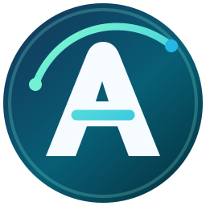

[](https://github.com/brauliobo/alacrium/releases)
[](LICENSE.md)
[](https://github.com/brauliobo/alacrium/commits/main/)

# Alacrium



Alacrium is a performance-focused Chromium browser maintained close to stable
Chromium releases. It is derived from [Thorium](https://github.com/Alex313031/thorium)
and continues to carry Thorium's applicable optimizations and browser patches
under an independent project identity and release cadence.

## Goals

- Follow stable Chromium releases promptly.
- Preserve useful performance, media, privacy, and interface improvements.
- Keep the Chromium overlay and patch set reproducible.
- Publish CPU-specific Linux builds where they provide a measurable benefit.
- Keep the browser compatible with Chrome extensions, profiles, and web APIs.

## Notable Features

- LLVM, LTO, PGO, and architecture-specific optimization support.
- AVX, AVX2, SSE3, and SSE4 build configurations.
- Widevine and expanded media codec support, including HEVC where supported.
- JPEG XL, FTP URL support, Global Privacy Control, and restored browser options.
- Chrome Sync support when builders provide valid Google API credentials.

See [docs/PATCHES.md](docs/PATCHES.md) for implementation and provenance details.

## Build

This repository is an overlay applied to the Chromium checkout at
`chromium/src` inside this repository, not a complete Chromium source tree.

```bash
./trunk.sh
./version.sh
./setup.sh
./build_incremental.sh 6
./build_incremental.sh 6 --packages
```

See [docs/BUILDING.md](docs/BUILDING.md) for platform-specific requirements.

## Linux Identity

- Package: `alacrium-browser`
- Binary: `alacrium-browser`
- Install directory: `/opt/alacrium-browser`
- Profile: `${XDG_CONFIG_HOME:-$HOME/.config}/alacrium`
- Cache: `${XDG_CACHE_HOME:-$HOME/.cache}/alacrium`
- Flags file: `${XDG_CONFIG_HOME:-$HOME/.config}/alacrium/alacrium-flags.conf`

## Lineage And Credits

Alacrium builds on Chromium and Thorium. Copyright notices and source links are
preserved throughout the patch set. Thanks to the Chromium and Thorium authors,
Alex313031, and the projects credited in [docs/PATCHES.md](docs/PATCHES.md).

Alacrium's name and artwork are independent from Thorium. Thorium references are
retained only where needed for source attribution and provenance.

## License

See [LICENSE.md](LICENSE.md) and the license files included with third-party
components. Chromium and inherited Thorium code retain their original notices.
